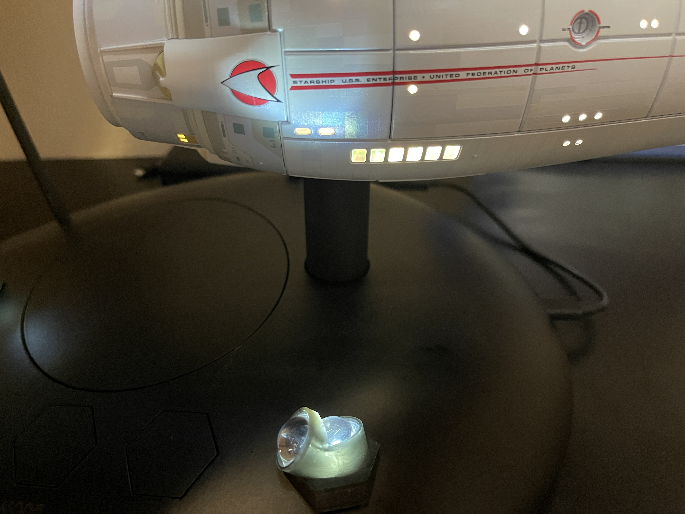
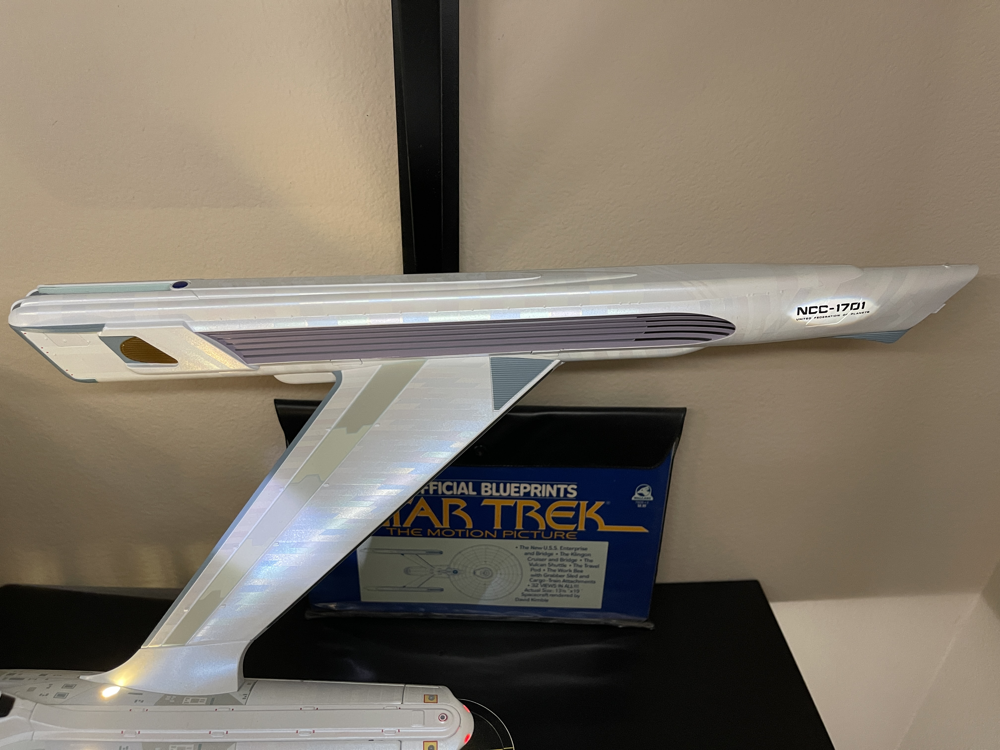
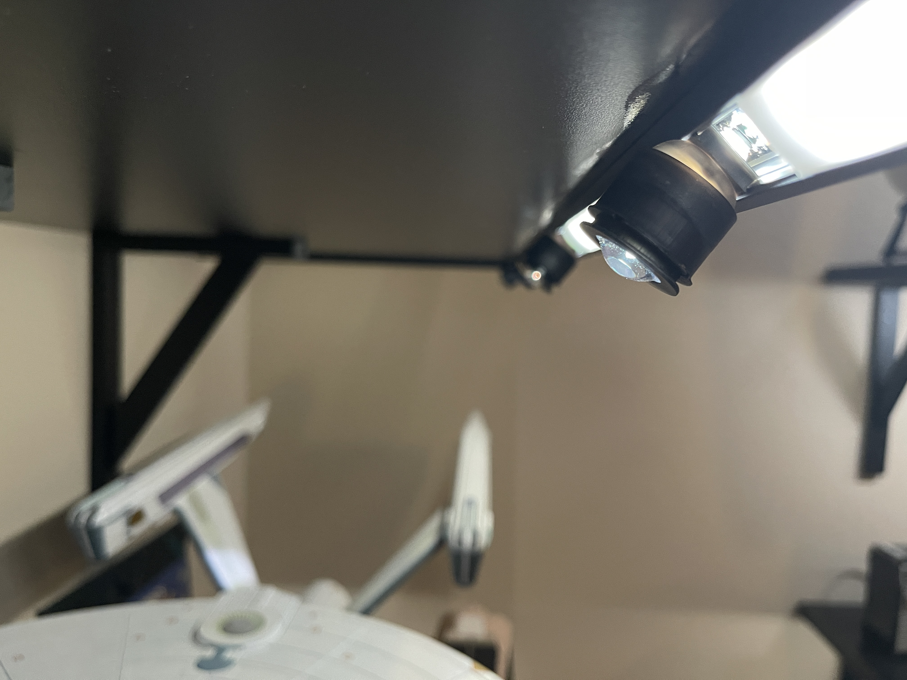
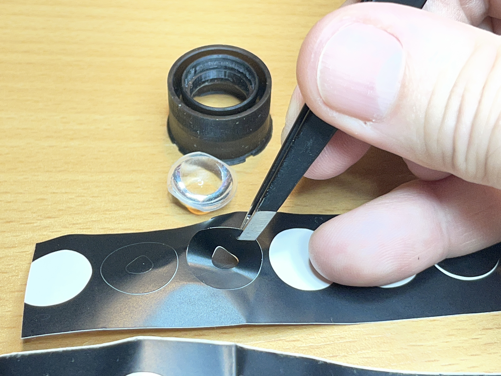
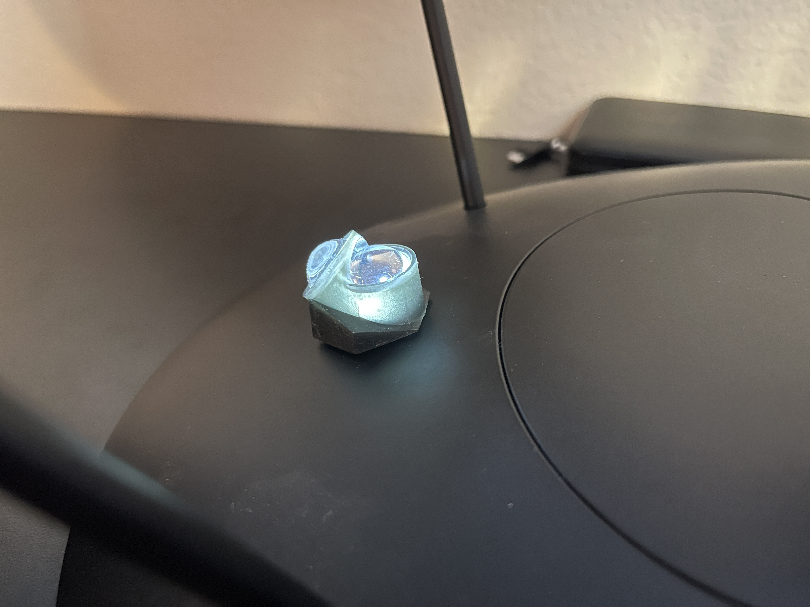

LED Spotlights for Enterprise Refit Models
==========================================
&copy; 2026 by Tony Fabris

https://github.com/tfabris/EnterpriseSpotlights

|  |      |
| -----------------------------------------------|----------------------------------------------|
|              |            |

#### This Project:

3D printed assemblies to project hull spotlights onto replica models of the Enterprise Refit from "Star Trek: The Motion Picture". I am using these for my Tomy brand die-cast replica of the Enterprise, but these could also theoretically be repurposed for other similar models such as a Polar Lights Enterprise kit.

#### The Problem:

When making the movie, the special effects artists lit the Enterprise's hull with spotlights. It is implied in the movie that these are all self-lights, like the ones which shine on the insignia of a cruise ship or a military vessel. But in the movie, those spotlights weren't actually self-lights. They were studio lights reflected via off-camera mirrors onto the hull of the Enterprise miniature.

This means it is nearly impossible to truly self-light a model kit or replica of the Refit Enterprise.

Many have tried. Some clever folks use a trick, commonly known as "Raytheon Lighting" among Enterprise kit builders, where LEDs are strategically positioned within the model's interior, to glow through the white plastic. Unfortunately, this technique causes its own difficulties, and it can't be used for my Tomy die-cast replica. Tomy **did** manage to Raytheon-light their outboard nacelle tips, which is incredibly helpful, since those are the most difficult ones to light.

#### My Solution:

Instead of trying to self-light the model, my system uses exterior lights, made of LEDs shining through lenses, to convincingly reproduce the spotlight effects seen in the movie. I chose direct illumination through lenses, rather than using mirrors, because these are less obtrusive than mirrors would have been.

Spotlight Fixtures
------------------

### Upper Spotlights:

I'm displaying my models on large 16" x 36" melamine shelves, and using 45° LED strip channel rails at the edges of the shelves to illuminate the models.

The LEDs strips I've installed into these channels are individually-addressable WS2812 programmable strips, commonly known as "NeoPixels". Most of the LEDs in the strips are set to a gentle glow to light my models, but, by programming specific single LEDs in the strips to shine brilliant white (I'm using RGB***W*** strips to get the extra ***white*** LEDs), I can mount some lenses in front of those particular LEDs to generate the spotlight effects.

That's where these 3D prints come in: The 3D printed lens holders snap into these rails, and each one holds two lenses in series, to allow a small amount of focusing. The 3D design has a semi ball joint, which allows a small amount of aiming (up/down about 22 degrees from center, and left-right about 10 degrees from center).

    
 

To get the special "shapes" of the spotlights (rounded triangles at the front for the top of the saucer, ellipses at the rear for the nacelles), my system uses [gobos](https://en.wikipedia.org/wiki/Gobo_(lighting)) to create the shapes. The gobos in this case are black vinyl stickers, cut to shape on a Cricut machine.

I'm using four spotlight assemblies on the top side of my model, one spotlight each, aimed at the following locations.
- Saucer top front, on the large nameplate and registration number.
- Saucer top rear, on the small nameplate just aft of the windows of the observation lounge.
- Warp pylon, starboard top.
- Warp nacelle, starboard rear, on the registration number the on end tip of the nacelle. Inboard only, because the Tomy collectible already illuminates the outboard ones using self-lighting (thank you, Tomy).

### Lower Spotlights:

My Refit Enterprise is the Tomy brand die-cast replica, released in 2026. That model comes with a special display stand which includes three LED sconces which already light the model from below. I merely needed to add some lenses to the base, to focus their LEDs a little more, via small 3D-printed holders. The holders slip onto the existing hexagonal light sconces in the base.

Note that these lower lens holders are specifically shaped to fit the Tomy base. For some other model, such as a Polar Lights kit, these won't work. If I had one of those models, I would probably need to generate the lower spotlights the same way as the upper ones.

For this Tomy base, I was able to use two lenses per sconce, one lens per spotlight, with no gobos required. By carefully positioning the two lenses near each LED on the base, two spotlights can be generated per LED. So I get six total spotlight effects out of the base of the Tomy model.
- Front-center sconce: Focuses two spotlights on the centerline of the saucer. Forward lens focuses on the registration number, rearward lens focuses on the "Enterprise" nameplate just ahead of the dorsal connector.
- Left and right sconces: Each one focuses two spotlights, one aiming forward, to create the side-spotlights on the underside of the saucer, and one facing the pennants on the sides of the secondary hull (with some overspill onto the dorsal connector).

   

Required Materials
==================

### Hardware:
  
  - A 3D ***resin*** printer:
    - https://www.anycubic.com
  - A Cricut cutting machine:
    - https://cricut.com/ 

### Supplies:

  - "ABS-Like" black resin:
    - https://www.amazon.com/dp/B0FPFZF6V9
    - https://www.amazon.com/dp/B0B12DRYDY
  - 15mm Convex Lenses:
    - https://www.amazon.com/dp/B0BR5PMGWD
    - https://www.amazon.com/dp/B0B2X662B8
    - Make sure to purchase enough lenses: Each spotlight assembly requires two lenses, and it is wise to get extras. I am using a total of 14 lenses (4 upper lens pairs and 3 lower lens pairs).
  - Black vinyl Cricut material:
    - https://www.amazon.com/dp/B0032JJS5O
  - Environmental Lights CS110-2m-B 45° LED strip channel rails, black anodized, end caps sold separately:
    - https://www.environmentallights.com/19358-cs110-2m-b.html
    - https://www.environmentallights.com/19364-el-cap-155-b.html
  - BTF-Lighting RGBW SK6812 LED strip, 60 Pixels/m:
    - https://www.amazon.com/dp/B079ZW1265
  - Polymer Optics 12° 15 mm Circular Beam Optic Collimators (either clear or diffused, I recommend diffused):
    - https://luxeonstar.com/product/120-180/
    - https://luxeonstar.com/product/185-180/
    - Make sure to purchase enough collimators: Each upper spotlight assembly requires one collimator, and it is wise to get extras. I am using four collimators for the four upper spotlights.
  - Power supply and lighting controller. A large variety of options are available to power and control the LED strips. It is a complicated subject; the short version is: I'm using a Mean Well LRS-200-5 200W 5V 40-amp power supply to drive several meters worth of LED strips, and an Arduino Mega 2560 to control them:
    - https://www.amazon.com/dp/B0131V99BA
    - https://www.amazon.com/dp/B07TGF9VMQ
    - ***Note:*** Don't try to drive more than a handful of LEDs "directly" off of an Arduino, without a separate power supply. For LED strips of any length, a proper power supply is required, to prevent frying the Arduino board.

### Software:

  - The source files for these 3D models:
    - https://github.com/tfabris/EnterpriseSpotlights/archive/refs/heads/master.zip
  - A slicer program - I'm using Chitubox Basic v1.9.4 at the moment:
    - https://www.chitubox.com/en/download/chitubox-free
  - Optional: Blender - I'm using v3.6 at the moment:
    - https://www.blender.org/
  - Cricut Design Space:
    - https://design.cricut.com/
  - Cricut design files:
    - https://design.cricut.com/landing/project-detail/69b8c28240372784c3de23df
  - Lighting control:
    - Indivdual LED color controls are required. Either use pre-built lighting control modules or create a custom-coded module. I'm using the FastLED library for the Arduino with my own custom code. Coding and lighting primer information:
      - https://github.com/fastled/fastled
      - https://www.youtube.com/watch?v=UhYu0k2woRM

3D Printing Lens Holders
========================

Print using a resin printer with ABS-Like resin in the Black color. 

- To print, import these files into the slicer program:
  - "Upper Spotlights.stl"
  - "Lower Spotlights.stl"
- Duplicate the upper spotlight objects in the slicer for as many as needed. I am using four upper spotlight assemblies.
- Slice and print.

#### IMPORTANT:
- ***Do not rotate the parts*** for printing, they should already be in the correct orientation.
- ***Do not add supports*** for printing, just print the parts directly to the print bed, they are designed to be printed without any supports.

Gobos
=====

Cut the gobo sticker material on the Cricut machine, based on the design file. The vinyl material, and the design file, are linked above.

Assembly
========

#### Modify the Polymer Optics collimators:

- Remove the plastic "hex holders" from the collimators: The collimators come with small plastic shrouds, remove the shrouds so that they're just the pure collimator lenses.

- Locate the two opposite sides of the hex flat faces of the collimators which are not perfectly smooth (where they were cut off a molding sprue).

- Sand those faces down to remove about 0.25mm of thickness from those faces. The collimators need to be ever so slightly narrower in one direction, so they fit into the rail.

  

- Sand the upper pointy corners of those same two faces. Sand away about 1mm of pointyness off of those four corners. This is to make room for the shroud to fully rotate on the ball joint, so that the spotlight can be aimed. Without sanding these corners away, the shroud can aim about 12 degrees up/down, with these corners sanded away, it can aim about 22 degrees up/down. 

- ***IMPORTANT***: Leave the other two corners ***un-sanded*** because they must stay pointy, to snap the collimator into the ball joint assembly in the next step.

#### Assemble Upper Spotlights:

- Snap the collimator into the ball joint part, with the pointy un-sanded corners fitting into the two snap retainers, and the sanded sides protruding visibly down the two rail gaps on the lower section.

|    |    |
| -------------------------------------------------------------|------------------------------------------------------------|

- Trim flashing off of the edges of the lenses, if any. Make sure the lenses are clean, as they will magnify any dust and debris into the spotlight image.

- Stick the desired Cricut gobo sticker onto the flat side of one of the lenses.

|     |    |
| --------------------------------|------------------------------------------------|

- Press-fit the gobo'd lens into the shroud part, lens bulge facing into the shroud, lens flat side facing the side which attaches to the Ball Joint part. 

- ***Note:*** All of the lens press-fits for these assemblies may be very tight, depending on the brand of lens. Ensure that the lens surface itself is not scratched during the press fitting process. A tiny amount of sanding on the edge lip of the lenses may be needed to ensure they can fit, using caution not to damage the lenses. Best practice is to sand only one or two sections of the edge, rather than the entire circumference.

|    |    |
| -------------------------------------------------------------|------------------------------------------------------------|

- Press-fit a lens into the focusing lens part, lens bulge facing out of the part. 

- Slide the focusing lens part into the shroud part, ensure that it can slide in and out slightly, to adjust its depth, to focus the gobo image onto the desired object.

- Press the shroud onto the ball joint carefully. Ensure it can rotate and angle smoothly.

- Snap the ball joint part into the LED railing. Pictured: A cross section of the rail (without LEDs) to show how it snaps into place. 

- Adjust the position of the spotlight along the rail until it is centered above the desired LED. The spotlight should be moveable by sliding along the rail (although it is a tight fit).

#### Assemble Lower Spotlights:

- Press-fit two lenses into each of the three lower lens holders. Ensure the lenses are fully seated in the holders, but be careful not to break the fragile resin-printed holders when press-fitting.

- Place the lens holders over the three hexagonal LED sconces in the base of the model. Identify which holders go atop which sconce on the base: In the photo above, clockwise from top, they fit the right (starboard) sconce, the left (port) sconce, and the front/center (bow) sconce.

 

Making Adjustments
==================

#### Aiming Lower Spotlights:

The lower lens holders are not aimable. They have been pre-aimed based on my particular model. I expect that all of the Tomy Enterprises should have the same base shape and LED positions, but there's no way for me to tell if other models will be slightly different. If modifications are needed, change the lens tube angles on the lower spotlights in the original Blender file "Lower Spotlights.blend" (Blender expertise required for this).

If changing the lens tube angles in the Blender file, recheck the following before exporting and reprinting:
- Before editing, make sure that the "Transform Orientation" menu (top center) is set to "Local". The tube angles must all be locally rotated in their child relationship to the flat tops of the hexagonal bases. 
- Since the bases are already rotated X=25° for printing to the bed, then before editing, rotate the bases to X=0°, then do your editing, then put them back to X=25°, so that their bases lay flat to the print bed for exporting and printing.
- When editing, ensure the lenses will not intersect each other physically, they are all very close to each other.
- When editing, ensure the lens tubes and "cutter" parts are all working correctly for all their boolean operations, for example, nothing is cut less or more than it should be (note that the boolean cutter parts are hidden, and buried in the item hierarchy inside other objects). It may be necessary to adjust the bottom polygon of each tube or cutter, so that everything works correctly again after the angles are changed.

#### Aiming Upper Spotlights:

First, ensure that the spotlights are getting the full brightness out of their LEDs. Slide each spotlight assembly slightly left and right along the channel (they should be fitting very tightly but still moveable). View the projected image of the LED shining through the spotlight, to tell whether the spotlight is perfectly centered and at its brightest.

Once centered, rotate, aim, and focus each spotlight until it's positioned perfectly on the model. I try to defocus my spotlights ever-so-slightly, to give them a soft edge on the model. Focusing is done by sliding the focusing lens slightly in or out.

#### Changing Gobo Shapes and Sizes:

The Cricut gobo design file is based on my particular model and shelves, so the gobos might need to be re-made if distances and/or angles change. If creating new gobos, use the following steps in the Cricut Design Space app:

- Create an outer circle which is 15.08mm (1.508cm or 0.59375 inches) in diameter. Press "Shapes", Select the circle shape, and once the circle has appeared on the canvas, press the SIZE button in the toolbar, and enter the desired size.

- Create an ellipse or other desired shape, for the center cutout, using similar steps. Resize this second shape to be the desired size. Move and position it so that it sits in the center of the circle.

- Drag-select both of the objects so they are selected at the same time.

- In the toolbar, press "Align" and choose "Center". The second shape is now centered in the circle.

- In the toolbar, press "Combine" (it may be hidden under a "More" menu) and select "Subtract".

- The circle should now have the second shape cut out of it.

- Recommend creating several versions of each gobo, with slightly different sizes of the cutout shape, for easier experimentation and trial-and-error.

To create a new cutout shape for the triangular-shaped spotlights (such as on the upper saucer section), my technique was:

- Create three oval shapes of different sizes. Smaller sizes to create the more pointy end of the spotlight shape, larger sizes to create the more rounded ends of the spotlight shape. Use ***oval*** shapes instead of ellipse shapes, which allows them to have straight sides yet also have rounded ends.

- Rotate and position them so that their ends overlap to form the desired triangular shape. 

- Remember to make the overall shape asymmetrically "lopsided" to compensate for the oblique angle from which the spotlight will be shining upon the saucer.

- The shape will likely have a "gap" in the center which will need to be covered up with a circle.

- Select all of those shapes and press "Combine" and select "Unite" to make them into a single unbroken shape.

- Duplicate that shape, then choose "Flip" to make a mirrored version of it. 

- Resize those shapes to the desired size. Recommend creating multiple sizes for greater ease of experimentation.

- Create new circles with those shapes inside, using the "Subtract" technique described above.

- The reason I create two mirrored versions: I always forget which direction the "lopsided-ness" needs to be when I get it onto the actual model, so I need to have both sets of gobos on hand, so I can try them both out in physical space.
